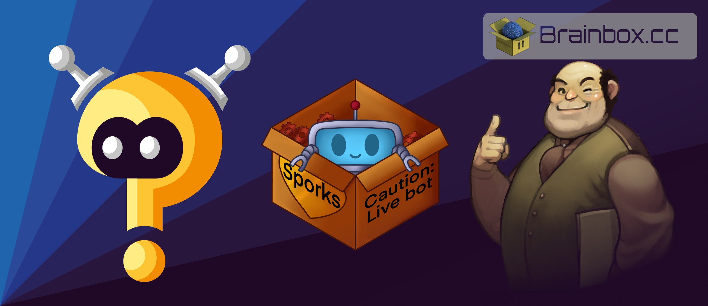

### Making games for the fun of it since 1993

- Author of [WinBot](https://www.winbot.co.uk), the Windows IRC bot all the way back in 1999
- The original creator of [InspIRCd](https://www.inspircd.org), a really popular IRC daemon
- Administrator of the [ChatSpike IRC Network](https://www.chatspike.net)
- Developer of [Botnix](https://www.botnix.org), the Perl IRC bot framework
- Developer of [Mr Boom's Firework Factory](https://store.steampowered.com/app/1013670/Mr_Booms_Firework_Factory/), an extremely difficult puzzle game
- Developer of [The Seven Spells of Destruction](https://www.ssod.org), a roleplaying game written in Unreal Engine 4
- Developer of [Sporks](https://sporks.gg), the learning Discord bot
- Developer of [TriviaBot](https://triviabot.co.uk), a Trivia/Quiz bot for Discord used on over 68000 servers with over 5 million users

I've been programming in some form since 1993, where i started out with [BBC BASIC](https://en.wikipedia.org/wiki/BBC_BASIC) on the [BBC Master 128k](https://en.wikipedia.org/wiki/BBC_Master) Microcomputer. From here i learned [6502 assembly](https://www.abebooks.co.uk/search/sortby/3/an/Lance+Leventhal+/tn/+6502+Assembly+Language) and then **Pascal** and **Delphi**, **Perl**, **PHP**, **C**, and **C++**. I know a **lot** of programming languages and a lot of databases, such as **MySQL** and **MSSQL**.

Here is a picture of my development setup:

